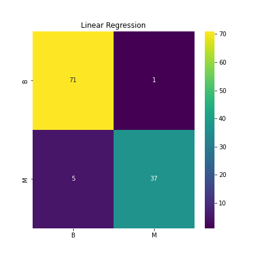
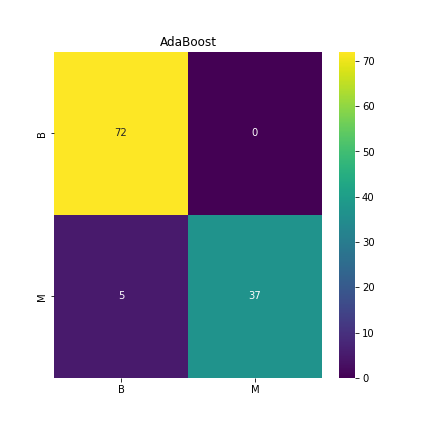
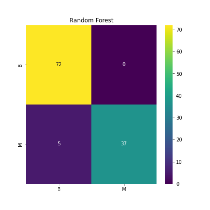

=======
# FINAL-PROJECT 

## Overview

### Breast Cancer

Breast cancer is the second most common type of cancer in Canadian women, behind only skin cancer. While it can be found in men, it is a much rarer occurrence.  It is estimated that approximately 27,000 Canadian women will be diagnosed this year with breast cancer. 1 in 8 women are expected to develop breast cancer within their lifetime and 1 in 33 will die from it.

## Refrences and Datasets 

[Link to the machine learning model dataset](https://www.kaggle.com/code/abhinavbhuyan/classification-xgboost-with-bayesian-optimization)

[Link to the general research dataset](https://www.kaggle.com/code/sarwat182/breast-cancer-analysis/data)

[Link to the google slides](https://docs.google.com/presentation/d/1fotAlGPDRyW_qi-WU9KC5ZwFHhCD2JULXEuIX8I3wA8/edit?usp=sharing)

### Purpose

The purpose of our analysis is to study malignant(cancerous) and benign(non-cancerous) tumors. Using the information gathered paired with machine learning, we hope to predict weather a tumor is more likely to be malignant based on it's characteristics.

## Data Cleaning and Analysis
For data cleaning and analysis, we used Pandas in the Jupyter Notebook development environment to process and clean the data. The reference CSV was pulled from the Kaggle database and was largely complete for analysis, although was checked for missing data, verifying data types, and any further cleaning was completed. The Database was then imported into pgadmin where it was edited into a SQl file to be used in our Machine learning.

## Machine Learning
SciKitLearn was be used as the Machine Learning library to process our cancer data. Logistic regression is the main classification tool we used for the analysis of all the data going into the supervised ML model. Logistic Regression was the method used to analyze the data, further boosted and compared to other methods including Adaptive Boosting and Random Forest methods, although the boosting methods only showed minor improvements to the results of the initial linear regression.

#### Linear Regression

For training, a test size of 0.20 was used for the train/test split. The results were fed into the default logistic regression model with default settings to produce a confusion matrix. The initial results are as shown.

#### AdaBoost

The second model ran was with using Adaptive Boosting. These models were run with the fololowing settings:
- n_estimators=20,
- max_features=5,
- max_depth=3,
- random_state=0

The learning rate was checked against values between 0 and 1, spaced then ran a second time after confirming the best values chosen for training and validation set accuracy without overfitting. A learning rate of 0.15 was eventually chosen and lead to a minor improvement in performance.

#### Random Forest

The last model run was testing the Random Forest method. This method used 128 as the number of estimators and default settings otherwise. This model showed similar results compared to the improvements the AdaBoost method showed.

## Databases
We retrieved our databases from Kaggle. We donloaded as a csv and used a variety of tools to clean and prepare for the machine learing stage. We used pandas in the Jupyter Notebook as well as SQL.   

## Dashboard
The current plan for creating a Dashboard will be taking the data we produce and using it in Tableau to display and share the data, as a flexible tool we can use with the data we have. We will be rexamining our needs and other possible ways to create a dashboard as we progress with the project.

[Link to Tablaeu dashboard](https://public.tableau.com/app/profile/noman7162/viz/Book1_16537947341150/Dashboard1?publish=yes)
